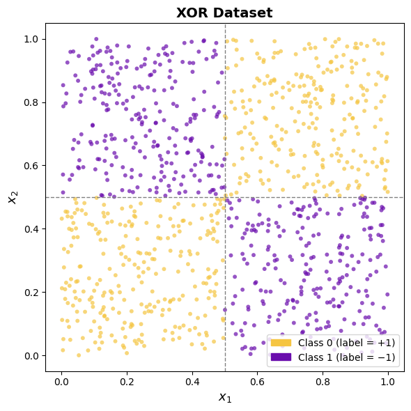
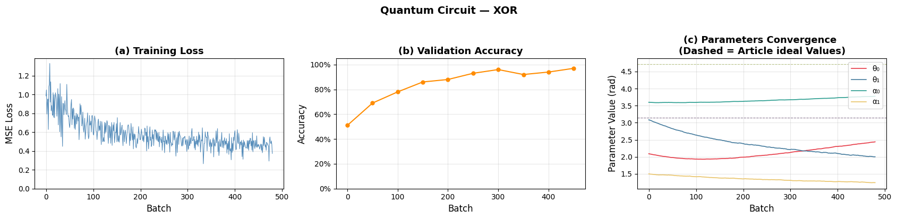
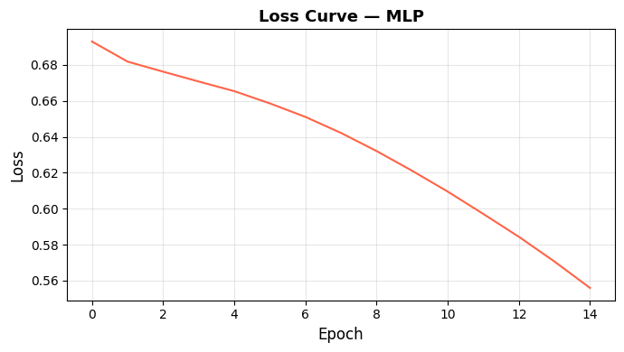
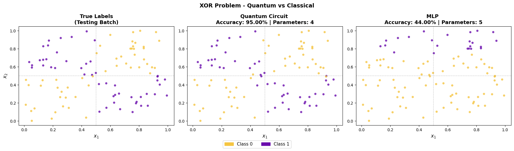
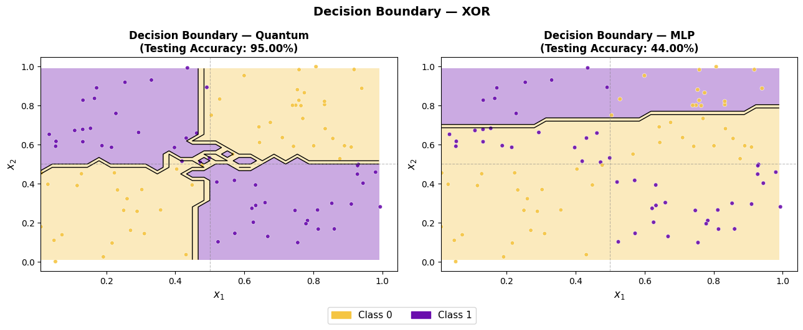

# Quantum Machine Learning — XOR Problem

A study and implementation of **Quantum Machine Learning (QML)** applied to the **XOR classification problem**, comparing a single-qubit quantum neural circuit with a classical neural network under approximately comparable parameter constraints.

This project was developed as part of a presentation on Quantum Machine Learning and is based, in particular, on the **single-qubit neural quantum circuit proposed by Ioan Valeriu Grossu (2021)**.

---

## 📌 Overview

Quantum Machine Learning combines concepts from **quantum computing** and **machine learning**, using quantum circuits as part of computational models capable of processing and learning from data.

In this project, the **XOR problem** is used as a simple benchmark to investigate the behavior of a quantum machine learning model and compare it with a classical approach.

The XOR problem is particularly interesting because it is **not linearly separable**. A single classical perceptron cannot correctly classify all four points of the XOR dataset because it can only create a linear decision boundary.

To address this limitation, the project implements two approaches:

* **Quantum:** a single-qubit neural quantum circuit inspired by Grossu (2021);
* **Classical:** a multilayer perceptron (MLP).

The models are intentionally configured with approximately similar numbers of trainable parameters, allowing their performance to be compared under a constrained architecture.

---

## 🎯 Objectives

The main objectives of the project are:

1. Introduce the fundamental concepts required to understand Quantum Machine Learning;
2. Review the mathematical foundations of quantum computation;
3. Present quantum states, superposition and entanglement;
4. Introduce quantum gates and quantum circuits;
5. Review fundamental concepts of classical machine learning;
6. Explain the limitations of the classical perceptron for nonlinear problems;
7. Introduce the XOR classification problem;
8. Implement a quantum neural circuit based on the approach proposed by Grossu (2021);
9. Implement a classical MLP with approximately the same number of parameters;
10. Train and evaluate both models;
11. Compare their classification performance.

---

# ⚛️ Quantum Computing Background

The project introduces the fundamental concepts of quantum computing required to understand the QML implementation, including quantum states, superposition, entanglement, unitary operators, measurement, quantum gates and quantum circuits.

A single qubit can be represented as

$$
|\psi\rangle = \alpha|0\rangle + \beta|1\rangle
$$

where

$$
|\alpha|^2 + |\beta|^2 = 1.
$$

The project also discusses common quantum gates such as:

* `X`
* `Z`
* `H`
* `S`
* `T`
* `Rx`
* `Ry`
* `Rz`
* `CNOT`

---

# 🤖 Classical Machine Learning

The classical machine learning portion introduces supervised learning, the perceptron and multilayer perceptrons.

A single perceptron computes a weighted combination of its inputs:

$$
y = \sum_i x_iw_i+b.
$$

Because a single perceptron can only generate a linear decision boundary, it cannot solve the XOR problem.

---

# 🔢 XOR Problem

The XOR dataset contains four input combinations:

| Input A | Input B | XOR |
| ------: | ------: | --: |
|       0 |       0 |   0 |
|       0 |       1 |   1 |
|       1 |       0 |   1 |
|       1 |       1 |   0 |

The dataset used in this experiment was generated using NumPy with a random seed and contains **1000 samples**, divided into:

* 800 training samples
* 100 validation samples
* 100 testing samples

### XOR Dataset



The visualization shows the nonlinear structure of the XOR classification problem and the two classes used by the models.

---

# 🧠 Quantum Machine Learning

Quantum Machine Learning is introduced as a hybrid approach combining classical machine learning techniques with quantum computation.

The quantum model used in this project is based on a **parameterized quantum circuit**, where trainable parameters are embedded into quantum gates.

Classical data is encoded into the quantum circuit through rotation gates, and measurements are used to obtain classical information from the quantum state.

---

# 🔬 Parameterized Quantum Circuit

The central implementation is inspired by the **single-qubit neural quantum circuit proposed by Grossu (2021)**.

The circuit uses:

* One qubit;
* Trainable rotation parameters;
* A Hadamard gate;
* Additional trainable parameters;
* Parameter-shift optimization;
* Qiskit/AerSimulator.

The model was simulated using **Qiskit's AerSimulator**.

The experiment used:

```text
Simulator: AerSimulator
Circuit evaluations: 1024
Learning rate: 0.01
Batch size: 25
Epochs: 15
```

After training, the parameters converged approximately to:

```text
θ₀ = 2.44
θ₁ = 2.00
α₀ = 3.77
α₁ = 1.24
```

The quantum model achieved:

* **97% validation accuracy**
* **95% testing accuracy**

---

# 💻 Implementation Inspired by the Article

A central part of this project is the reproduction and adaptation of the quantum XOR approach presented by Grossu (2021).

The implementation was developed in **Python using Qiskit**, translating the theoretical structure of the single-qubit neural quantum circuit into an executable simulation.

The experiment focuses on reproducing the core idea of the article while applying the model to a generated XOR dataset.

The quantum circuit is trained through parameter optimization, with the **parameter-shift rule** being used to obtain the gradients required for updating the trainable parameters.

The goal of this implementation is not simply to reproduce a reported accuracy, but to explore how the proposed architecture behaves when implemented and trained under the experimental configuration used in this project.

---

# 📈 Quantum Training

The training process shows the evolution of the quantum model during optimization.

### Training Loss and Validation Accuracy

The training loss decreases throughout the optimization process, while the validation accuracy increases and reaches approximately 97%.

### Parameter Convergence

The trainable parameters progressively converge during the optimization process. The dashed lines represent the ideal values discussed in the reference article.



---

# 🧮 Classical Baseline

For comparison, a classical multilayer perceptron was implemented with:

* One hidden layer;
* One neuron in the hidden layer;
* Approximately the same number of trainable parameters;
* Learning rate of `0.01`;
* Batch size of `25`;
* `15` iterations.

The intentionally small architecture provides a parameter-constrained comparison with the quantum model.

The classical model achieved a testing accuracy of:

**44%**

### Classical MLP Loss Curve



Although the classical model trained considerably faster, its limited number of parameters resulted in significantly poorer performance on the XOR classification task.

---

# ⚔️ Quantum vs Classical

The main comparison between the two approaches is shown below.



The comparison includes:

* True testing labels;
* Quantum circuit predictions;
* Classical MLP predictions;
* Testing accuracy;
* Number of trainable parameters.

| Model                  | Parameters | Test Accuracy |
| ---------------------- | ---------: | ------------: |
| Quantum Neural Circuit |          4 |       **95%** |
| Classical MLP          |          5 |       **44%** |

The quantum circuit achieved considerably higher testing accuracy under the constrained architectures used in this experiment.

However, this result **should not be interpreted as proof of a general quantum advantage**. The classical model was deliberately restricted to approximately the same parameter scale as the quantum model. A larger classical neural network can solve XOR effectively.

---

# 🗺️ Decision Boundary

A particularly useful way to visualize the results is through the decision boundaries learned by each model.



The figure compares the decision regions generated by the quantum circuit and the classical MLP.

The quantum model produces a considerably more suitable classification structure for the nonlinear XOR dataset, whereas the constrained MLP struggles to reproduce the required nonlinear separation.

---

# 📊 Results

The main results can be summarized as follows:

| Model                      | Test Accuracy |
| -------------------------- | ------------: |
| **Quantum Neural Circuit** |       **95%** |
| **Classical MLP**          |       **44%** |

The quantum circuit therefore demonstrated significantly better performance under the specific experimental configuration used in this project.

The experiment is particularly interesting because the quantum model uses only a **single qubit** and a small number of trainable parameters.

---

# 🛠️ Technologies

The project was developed using:

* **Python**
* **Qiskit**
* **Qiskit Aer / AerSimulator**
* **NumPy**
* **scikit-learn**
* Parameterized quantum circuits
* Parameter-shift optimization
* Classical neural networks

The quantum circuit was evaluated using a classical simulator rather than physical quantum hardware.

---

# 📁 Project Structure

```text
.
├── README.md
├── notebooks/
│   └── XOR_QML.ipynb
│
├── src/
│   ├── quantum_model.py
│   ├── classical_model.py
│   └── dataset.py
│
├── images/
│   ├── xor_dataset.png
│   ├── training_loss_accuracy.png
│   ├── parameter_convergence.png
│   ├── loss_curve.png
│   ├── quantum_vs_classical.png
│   └── decision_boundary.png
│
└── requirements.txt
```

---

# 📚 Reference Model

The quantum implementation is inspired by:

> Grossu, I. V. (2021). *Single qubit neural quantum circuit for solving exclusive-OR*. MethodsX, 8, 101573.

**DOI:** `10.1016/j.mex.2021.101573`

---

# ⚠️ Limitations

Several limitations should be considered when interpreting the results:

1. The quantum circuit was evaluated using a classical simulator.
2. The XOR dataset is extremely simple compared with real-world machine learning datasets.
3. The classical architecture was deliberately constrained.
4. The experiment does not demonstrate general quantum advantage.
5. Results depend on parameter initialization and training configuration.
6. The comparison is primarily intended to investigate the behavior of a small parameterized quantum circuit.

---

# 🚀 Future Work

Possible extensions include:

* Testing larger datasets;
* Increasing the number of qubits;
* Exploring different quantum circuit architectures;
* Testing different data-encoding strategies;
* Investigating alternative optimization algorithms;
* Introducing realistic quantum noise;
* Running the circuit on real quantum hardware;
* Comparing against larger classical neural networks;
* Investigating more complex classification problems;
* Studying potential quantum advantages in practical machine learning applications.

---

# 👨‍🔬 Authors

**M.Sc. Daniel Paiva**


**M.Sc. Gabriel Ferreira**

2026
